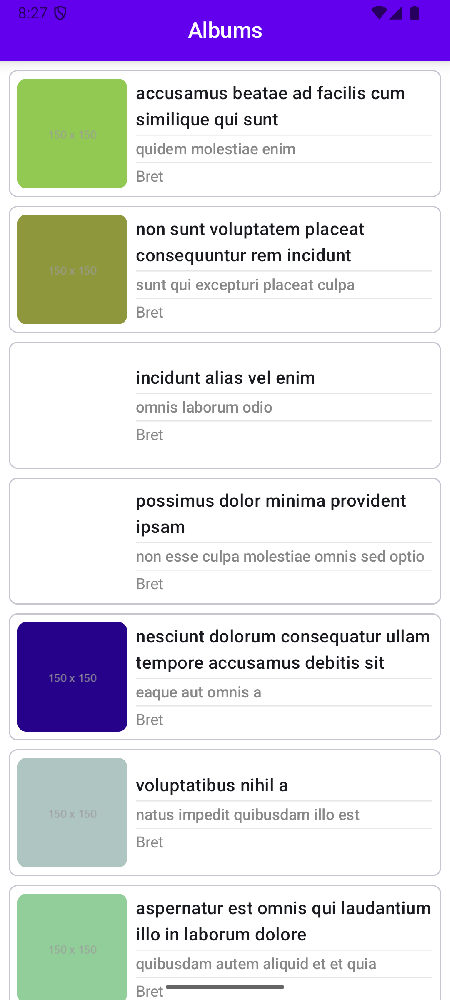

# Photo Library App

This is a sample Android application built using Jetpack Compose, Retrofit, Gson, Glide, Dagger
Hilt, and Kotlin Coroutines. It fetches data from
the [JSONPlaceholder API](https://jsonplaceholder.typicode.com/) and displays a list of photos with
their titles, album names, and usernames.

## Features

- **Jetpack Compose:** Modern UI toolkit for building native Android UIs.
- **Retrofit:** Type-safe HTTP client for making API requests.
- **Gson:** JSON to Kotlin model conversion.
- **Glide:** Image loading and caching.
- **Dagger Hilt:** Dependency injection.
- **Kotlin Coroutines:** Asynchronous programming.
- **Clean Architecture:** Separation of concerns for better maintainability.
- **SOLID Principles:** Adherence to SOLID design principles.
- **Loading Indicator:** Shows a loading indicator while fetching data.
- **Error Handling:** Displays a fallback message if the API call fails.
- **Empty State Handling:** Displays a fallback UI if there is no data.
- **Caching:** Caches API responses and shows data from the cache if no network is available.
- **Unit Testing:** Includes unit tests for the ViewModel and Repository.

## Architecture

The app follows a clean architecture pattern with the following layers:

- **Presentation Layer:** Contains the UI components (`MainActivity`, `MainScreen`) and the
  `MainViewModel`.
- **Domain Layer:** Contains the business logic and the `PhotoRepository` interface.
- **Data Layer:** Contains the data access logic, including the `PhotoApi`, `PhotoRepositoryImpl`,
  and data models.

## Dependencies

- `androidx.core:core-ktx`
- `androidx.appcompat:appcompat`
- `com.google.android.material:material`
- `androidx.compose.ui:ui`
- `androidx.compose.material:material`
- `androidx.compose.ui:ui-tooling-preview`
- `androidx.lifecycle:lifecycle-runtime-ktx`
- `androidx.activity:activity-compose`
- `com.squareup.retrofit2:retrofit`
- `com.github.bumptech.glide:glide`
- `com.google.dagger:hilt-android`
- `com.google.dagger:hilt-android-compiler`
- `org.jetbrains.kotlinx:kotlinx-coroutines-android`

## Getting Started

1. Clone the repository.
2. Open the project in Android Studio.
3. Build and run the application.

## Testing

To run the unit tests, navigate to the `app/src/test/java/com/example/photolibrary` directory and
run the tests.

## Screenshots

<table>
  <tr>
    <td></td>
    <td></td>
  </tr>
  <tr>
    <td align="center">Album Screen</td>
    <td align="center">Error Handling</td>
  </tr>
</table>

## Future Improvements

- Implement UI testing.
- Add more robust error handling.
- Implement a more sophisticated caching mechanism.
- Add pagination for large datasets.

## License

[MIT](https://opensource.org/licenses/MIT)
